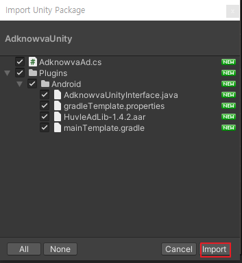
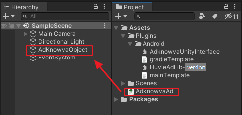
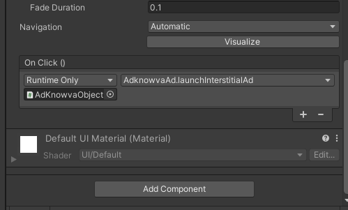

# AdKnowva_SDK Unity3D install Guide

## 공통 기본 요건
- Unity 2020.3.25f1 이상 사용
- Google Play Service 20.5.0 이상
- Android Target API 31


## 애드노바 설치 가이드
## Usage
### 1. AdKnowvaUnityPackage 및 SampleSource 다운로드
- [AdKnowvaUnityPackage](https://github.com/Huvle-Ad/AdKnowva_SDK_KR/releases/tag/1.5.1)

### 2. Unity Project Package import


### 3. Hierachy 에 HuvleSDKObject 생성

1. Hierarchy 패널의 [+] 클릭
2. [Create Empty] 클릭
3. 생성된 Object 이름을 AdKnowvaObject로 변경(이름은 아무것이나 상관없음) 
4. AdKnowvaAd script 를 AdKnowvaObject 드래그 앤 드롭



### 4. AdKnowvaUnityInterface.java 설정

1. 광고 적용시 발급 받은 ZoneID 로 변경 
2. 배너 광고 위치 , 전면 광고 설정

```java

//Banner AD
public void setHuvleAD(Activity context){

        BannerAdView bav = new BannerAdView(context);

        RelativeLayout layout = new RelativeLayout(context);

        RelativeLayout.LayoutParams layoutParams = new RelativeLayout.LayoutParams(RelativeLayout.LayoutParams.MATCH_PARENT,
                RelativeLayout.LayoutParams.WRAP_CONTENT);
        layoutParams.addRule(RelativeLayout.ALIGN_PARENT_BOTTOM); //banner position
        

        bav.setLayoutParams(layoutParams);
        layout.addView(bav);
    /*
         For the "test" value below, 
         please go to https://ssp.huvle.com/ to sign up > create media > Test your app after typing zoneid.
         Next, contact Huvle before releasing your app for authentication. You must not change the banner size.
    */

        bav.setPlacementID("test"); // 320*50 banner testID , 300*250 banner test ID "testbig"
        bav.setShouldServePSAs(false);
        bav.setClickThroughAction(ANClickThroughAction.OPEN_DEVICE_BROWSER);
        bav.setAdSize(320, 50); //bav.setAdSize(300, 250);
        // Resizes the container size to fit the banner ad
        bav.setResizeAdToFitContainer(true);
        // bav.setExpandsToFitScreenWidth(true);


        AdListener adListener = new AdListener() {
            @Override
            public void onAdRequestFailed(AdView bav, ResultCode errorCode) {
                if (errorCode == null) {
                    Log.v("HuvleBANNER", "Call to loadAd failed");
                } else {
                    Log.v("HuvleBANNER", "Ad request failed: " + errorCode);
                }
            }

            @Override
            public void onAdLoaded(AdView ba) {Log.v("HuvleBANNER", "The Ad Loaded!");}
            @Override
            public void onAdLoaded(NativeAdResponse nativeAdResponse) {}
            @Override
            public void onAdExpanded(AdView bav) {}
            @Override
            public void onAdCollapsed(AdView bav) {}
            @Override
            public void onAdClicked(AdView bav) {}
            @Override
            public void onAdClicked(AdView adView, String clickUrl) {}
            @Override
            public void onLazyAdLoaded(AdView adView) {}
        };
        bav.setAdListener(adListener);
        bav.init(context);
        bav.startAd();

        context.addContentView(layout,layoutParams);

    }


//Interstitial AD
public void launchInterstitialAd(Context context) {
    final InterstitialAdView iadv = new InterstitialAdView(context);
    //bav.setBackgroundColor(0xffffffff); // background color
    iadv.setCloseButtonDelay(10 * 1000);  // Activate close button after 10 seconds
    //badv.setCloseButtonDelay(0);        // Activate close button immediately
    //iadv.setCloseButtonDelay(-1);       // Disable close Button

/*
    As for the “testfull” value below, please go to http://ssp.huvle.com/ to sign up > create media > select the 'fullscreen' checkbox > test your app after entering the zoneid corresponding to the 'fullscreen' option.
    Next, contact Huvle before releasing your app for authentication.
    You must not change the banner size.
*/
    iadv.setPlacementID("testfull"); // zoneId
    iadv.setShouldServePSAs(false);


    iadv.setClickThroughAction(ANClickThroughAction.OPEN_DEVICE_BROWSER);


    AdListener adListener = new AdListener() {
        @Override
        public void onAdRequestFailed(AdView bav, ResultCode errorCode) {
            if (errorCode == null) {
                Log.v("HuvleInterstitialAd", "Call to loadAd failed");
            } else {
                Log.v("HuvleInterstitialAd", "Ad request failed: " + errorCode);
            }
        }

        @Override
        public void onAdLoaded(AdView ba) {
            Log.v("HuvleInterstitialAd", "The Ad Loaded!");
            iadv.show();
        }

        @Override
        public void onAdLoaded(NativeAdResponse nativeAdResponse) {
            Log.v("HuvleInterstitialAd", "Ad onAdLoaded NativeAdResponse");
        }

        @Override
        public void onAdExpanded(AdView bav) {
            Log.v("HuvleInterstitialAd", "Ad expanded");
        }

        @Override
        public void onAdCollapsed(AdView bav) {
            Log.v("HuvleInterstitialAd", "Ad collapsed");
        }

        @Override
        public void onAdClicked(AdView bav) {
            Log.v("HuvleInterstitialAd", "Ad clicked; opening browser");
        }

        @Override
        public void onAdClicked(AdView adView, String clickUrl) {
            Log.v("HuvleInterstitialAd", "onAdClicked with click URL");
        }

        @Override
        public void onLazyAdLoaded(AdView adView) {
            Log.v("HuvleInterstitialAd", "onLazyAdLoaded");
        }
    };

    iadv.setAdListener(adListener);
    iadv.loadAd();

}


```

### 5. AdKnowvaAd.cs 적용
1. Script 를 이용해서 애드노바를 적용할 위치에 전면광고 또는 배너광고 함수를 적용시킨다

```C#

public class AdknowvaAd : MonoBehaviour
{
    AndroidJavaClass unity_player;
    AndroidJavaObject activity;

    AndroidJavaObject Huvle;

 
    void Start()
    {
        unity_player = new AndroidJavaClass("com.unity3d.player.UnityPlayer");
        activity = unity_player.GetStatic<AndroidJavaObject>("currentActivity");
        Huvle = new AndroidJavaObject("com.unity3d.player.AdknowvaUnityInterface");
     
        
        activity.Call("runOnUiThread", new AndroidJavaRunnable(() => {
            Huvle.Call("setHuvleAD", activity);
        }));
    }

 public  void launchInterstitialAd()
    {
       
        activity.Call("runOnUiThread", new AndroidJavaRunnable(() => {

            Huvle.Call("launchInterstitialAd", activity);
          
        }));
    }
}

```


> 버튼에 전면광고를 적용한 예.

***


## License
Huvle SDK 의 저작권은 (주)허블에 있습니다.
```
Huvle SDK Android
Copyright 2021-present Huvle Corp.

Unauthorized use, modification and redistribution of this software are strongly prohibited.
```

